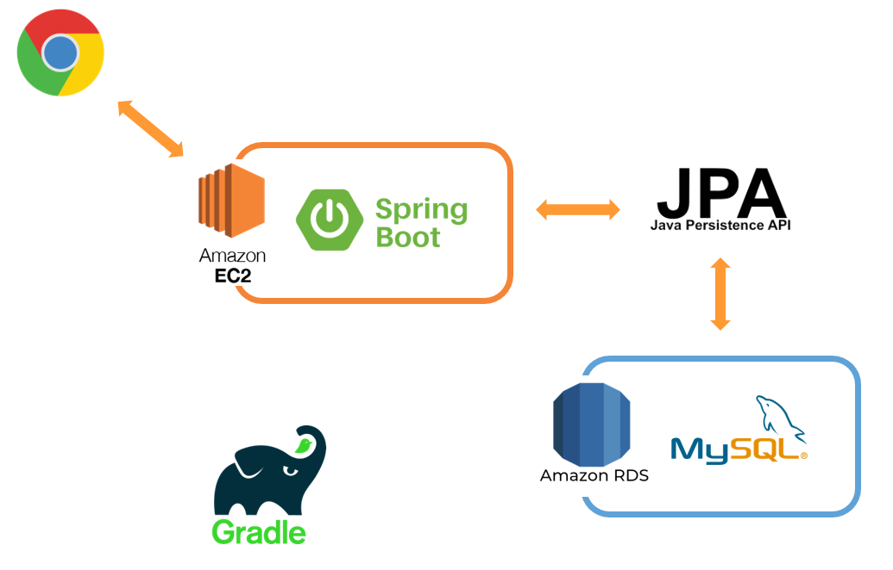

# 게시판 개인 프로젝트

# 1.프로젝트 소개
Java와 스프링 부트 기반으로 만들어본 게시판이다.
독학하여 웹에 대한 전반적인 원리, 기초를 배우고자 만들어보았다.

참고:스프링 부트와 AWS로 혼자 구현하는 웹 서비스(도서), 인프런(유료 강의 사이트)의 김영한 님 강의들.

# 2.기술 스택

## 개발 환경
* Java 11  
* 인텔리제이  
* Gradle 7.4.1  

## Front-end
* HTML 5
* Bootstrap 4.3.1
* Thymeleaf 

## Back-end
* JPA  
* Validation  
* Thymeleaf  
* oauth2  
* spring security  
* lombok  

## 데이터베이스
* MySQL

## 배포
* AWS의 EC2에 배포. RDS는 MySQL

## Version Control
* Git
* GitHb

# 3. 주요 기능들
* 게시글 작성 / 자세히 보기 / 수정 / 삭제
* 댓글 작성 / 수정 / 삭제
* 기본 회원가입 (Spring Security)
* OAuth2.0을 이용한 회원가입 (구글 , 네이버)
* 게시글 검색 기능
* 페이징 기능
* 조회수
* 검증 기능(비밀번호 생성 규칙 등.)

# 4. 프로젝트 구성도

# 5. ERD

# 6. API 설계
  

# 7. 데모 영상 / 사진

## 회원가입 / 로그인 / 글 등록하기

## 글 수정 / 삭제하기

## OAuth로 로그인 하기

## 댓글 등록 / 수정 / 삭제하기

